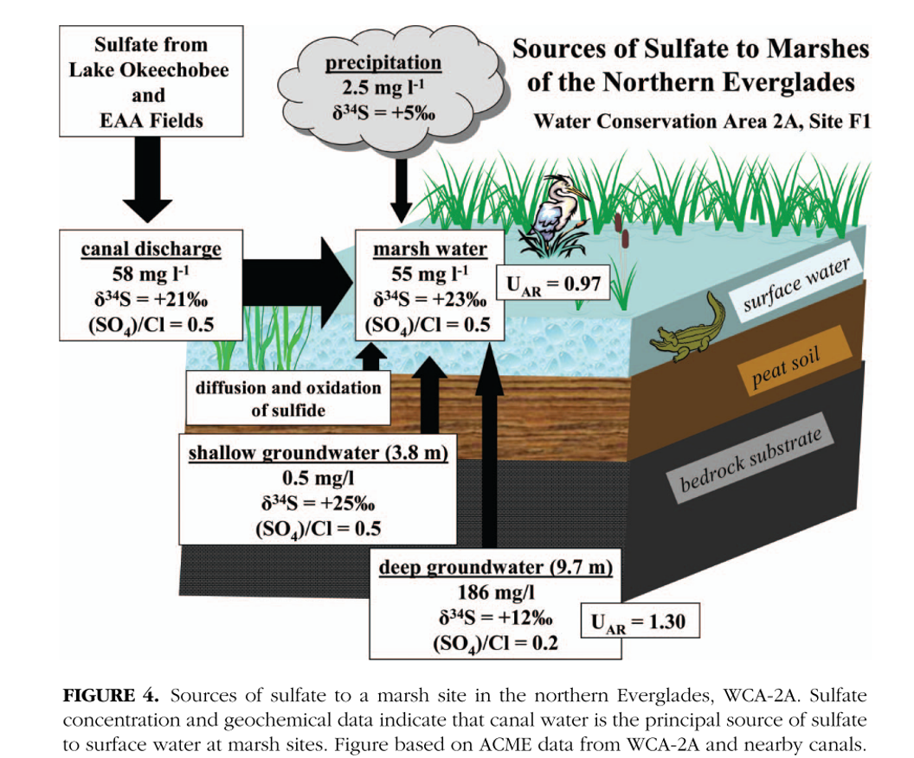

This exercise will take some concepts discussed in Orem et al. (2011) and apply them to an alpine wetland ecosystem.

Alpine wetlands are very fascinating systems. Although they may look different than the lowland wetlands you are used to, I hypothesize that they are key control points in the alpine ecosystem. You are working up at Niwot Ridge, sampling wetlands of 3 distinct types: alpine wet meadows (AWMs), subalpine wetlands (SAWs), and periglacial solifluction lobes(PSLs). You are interested in whether long-range transport of sulfur in aerosols through wet deposition is significantly raising the natural levels of sulfur in these systems. If the sulfur levels are high, you want to know if the wetlands are acting as a sink for this sulfur, or whether a constructed wetland could help improve water quality for the greater Boulder Creek watershed. 

```{r "load packages", include=FALSE, message=FALSE}
library(tidyverse)
```

# Part 1: Determining Sulfur Source

```{r}
s_data <- tibble(
  type = c("AWM", "SAW","PSL"),
  surface_sulfate = c(3.4, 6.2, 4.2), #mg/L
  d34S = c(6, 20, 12), #permill
)
```

Due to the dearth of information on sulfur isotopes in alpine wetlands, you turn to the wetland literature and find the following figure in Orem et al. (2011):



In the chunk below, estimate what your potential sources in this alpine system may be, as well as their isotopic values and concentrations. Justify your thoughts to members of your breakout room based on Tuesday's discussion. HINT: you should have 4 potential sources.

```{r}
sources <- tibble(
  name = c(),
  surface_sulfate = c(),
  d34S = c()
)
```

Fill in the mass balance equation below based on identified potential S sources to solve for the $\delta^{34}S$ value in the surface water sulfate of each wetland type:

$$
\delta^{34}S_{surface} = f_{source1} \cdot \delta_{source1} + f_{source2} \cdot \delta_{source2} + f_{source3} \cdot \delta_{source3} + f_{source4} \cdot \delta_{source4}
$$
