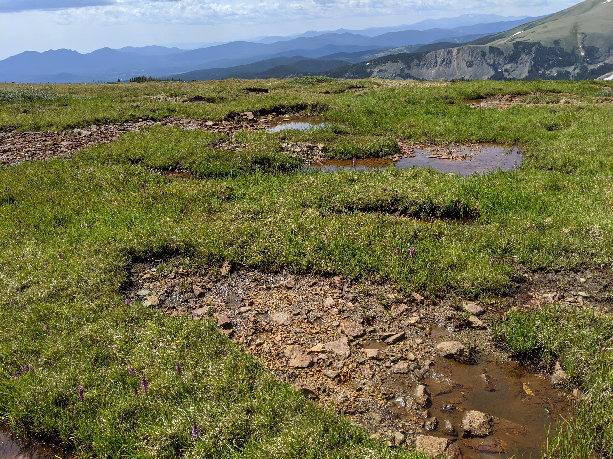
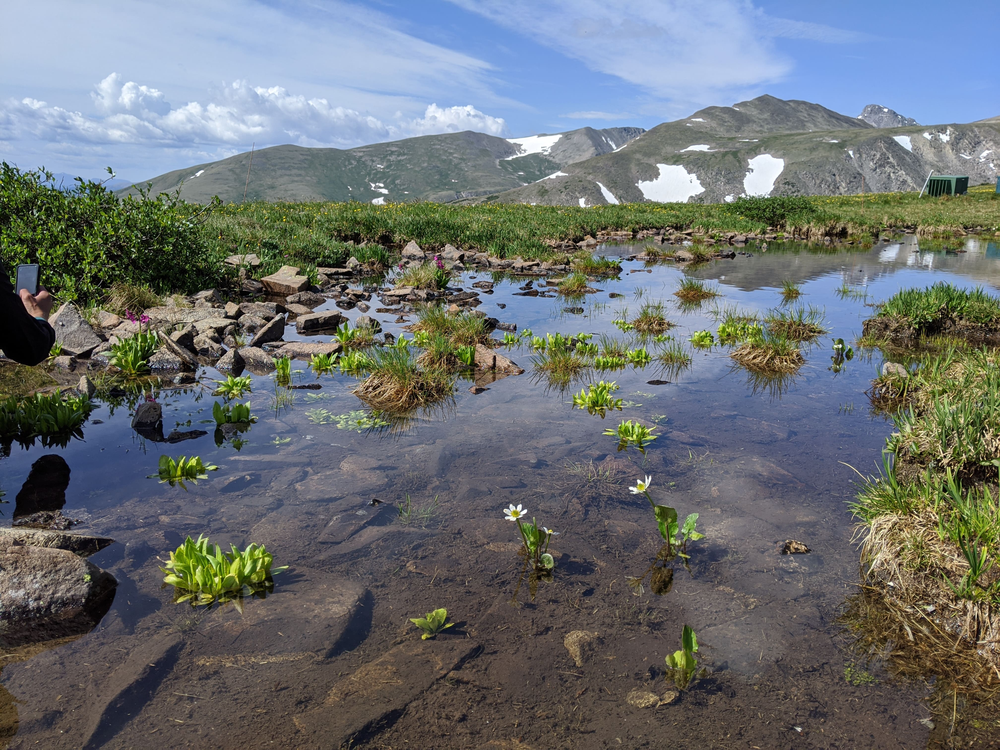
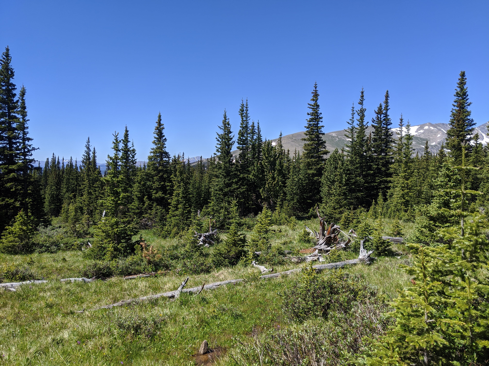

This exercise will take some concepts discussed in Orem et al. (2011) and apply them to an alpine wetland ecosystem.

Alpine wetlands are very fascinating systems. Although they may look different than the lowland wetlands you are used to, they may be key control points in the alpine ecosystem. You are working up at Niwot Ridge, sampling wetlands of 3 distinct types: alpine wet meadows (AWMs), subalpine wetlands (SAWs), and periglacial solifluction lobes(PSLs). You are interested in how much sulfur is entering these remote systems through wet deposition, both as a fractional contribution and total input. You remember the findings of Orem et al. (2011), who found that at low surface water sulfate concentrations, you can track the source of sulfate using stable isotope mass balance. You are able to take some measurements, but still need to contruct idealized models of sulfur transportation and transformation in these wetlands.







```{r "load packages", include=FALSE, message=FALSE}
library(tidyverse)
library(ggplot2)
```

# Part 1: Constructing the System

You measure the following sulfate concentrations [mg/L] and $\delta^{34}S$ values [permil] in the surface water of each wetland type. You also measure the isotopic composition of the precipitation to be +5.0 permil. Run the following chunk to examine your data. 
```{r}
d34S_awm_surf <- 2.96
d34S_psl_surf <- 5.01
d34S_saw_surf <- 3.42
conc_awm <- 3.4
conc_psl <- 3.0
conc_saw <- 6.2

d34S_precip <- 5.0

s_data <- tibble(
  wetland_type = c("AWM", "PSL","SAW"),
  concentration = c(conc_awm, conc_psl, conc_saw), #mg/L
  d34S = c(d34S_awm_surf, d34S_psl_surf, d34S_saw_surf), #permil
)

s_data
```

## 1A: Identifying Sources

Due to the dearth of information on sulfur isotopes in alpine wetlands, you turn to the wetland literature and find the following figure in Orem et al. (2011):

```{r}
knitr::include_graphics("everglades.png")
```

Looking at your wetlands, they don't receive any canal discharge, but there are runoff inputs flowing downslope, mostly from snowmelt. Therefore, your total mass balance equation for the isotopic composition of surface sulfate in each wetland becomes:

$$
\delta^{34}S_{surface} = f_{precip} \cdot \delta_{precip} + f_{shallow} \cdot \delta_{shallow} + f_{deep} \cdot \delta_{deep} + f_{runoff} \cdot \delta_{runoff}
$$

## 1B: Some Helpful Information

In doing some further research into the types of wetlands, you discover a few important pieces of information (let's call them Helpful Hints):

1. PSLs have an underlying ice lens, effectively cutting them off from groundwater inputs
2. SAWs lay downslope below treeline, so receive runoff from the AWM and PSL.
3. All systems are close together, so will have the same total sulfate input from precipitation.
4. Due to the depth of the peat soil layer, sulfur species in deep groundwater take a very long time to diffuse to the surface, and will only contribute 1% of the sulfate in the surface pool if not cut off.

### Q: With the following information, which sources will likely be the primary contributors to each wetland type?
PSLs: 
AWMs: 
SAWs: 
  
## 1C: Estimating Sulfur Isotope Fractionation in Shallow vs. Deep Groundwater

You receive some magical hypothetical information from the literature, that the fractionation factor $\alpha$ for microbial sulfate reduction to sulfide is 0.96.  
$$
\alpha_{HS^- / SO_4^{2-}} = \frac{\delta^{34}S_{HS^-} + 1}{\delta^{34}S_{SO_4^{2-}} + 1} = 0.96
$$
We can use this equation to estimate $\delta^{34}S$ values for shallow groundwater and deep groundwater.

For shallow groundwater, let's assume that 35% of the sulfur is diffused sulfate in oxic pore spaces, and 65% is sulfide that has been reduced once by SRB.
For deep groundwater, let's assume that 5% of the sulfur is diffused sulfate in oxic pore spaces, and 95% is sulfide that has been reduced by SRB in shallow groundwater, re-oxidized, and then reduced again. 

In the chunk below, calculate the $\delta^{34}S$ value of both shallow and deep groundwater for each system.

```{r}
d34S_awm_sgw <- 
d34S_psl_sgw <- 
d34S_saw_sgw <- 

d34S_awm_dgw <- 
d34S_psl_dgw <- 
d34S_saw_dgw <- 
```

## 1D: Mini Mass Balance to Estimate Isotopic Composition of Runoff

Now to estimate the isotopic compositions of the runoff. 

Runoff flowing into PSLs and AWMs is direct snowmelt. Only a small fraction of the snowmelt has been reduced and sequestered in the soil during melting and transportation, leaving the runoff enriched wrt precipitation by +0.05 permil.

Runoff going into the SAW is 10% snowmelt, 45% water that has drained from the AWM, and 45% water that has drained from the PSL.

Calculate the isotopic compositions of runoff coming into each wetland type in the chunk below: 

```{r}
d34S_awm_runoff <- 
d34S_psl_runoff <- 
d34S_saw_runoff <- 
```


Based on this information, you can fill out your table of information a bit further:

```{r}
s_data <- s_data %>%
  mutate(
    precip_d34S = d34S_precip,
    sgw_d34S = c(d34S_awm_sgw, d34S_psl_sgw, d34S_saw_sgw), 
    dgw_d34S = c(d34S_awm_dgw, d34S_psl_dgw, d34S_saw_dgw),
    runoff_d34S = c(d34S_awm_runoff, d34S_psl_runoff, d34S_saw_runoff)
  )

s_data
```
  
## 1E: Calculating the Fractional Contributions

Yay you have all the delta values! Now we're going to determine the fractional contributions from each source.
Determine the missing fractional contributions of sulfate from each potential source in the chunk below. HINTS: Look at the Helpful Hints! And maybe pull up Wolfram Alpha...

```{r}
f_psl_runoff <- 
f_psl_sgw <- 
f_psl_dgw <- 
f_psl_precip <- 

f_awm_precip <- 
f_awm_dgw <- 
f_awm_runoff <- 
f_awm_sgw <- 

f_saw_precip <- 
f_saw_dgw <- 
f_saw_runoff <- 
f_saw_sgw <- 
```


# Part 2: Visualize it!
```{r}
awm <- data.frame(
  type = c(rep("AWM", 4), rep("PSL", 4), rep("SAW", 4)),
  source = c(rep(c("Runoff", "Precip", "Shallow GW", "Deep GW"), 3)),
  value = c(f_awm_runoff, f_awm_precip, f_awm_sgw, f_awm_dgw, f_psl_runoff, f_psl_precip, f_psl_sgw, f_psl_dgw, f_saw_runoff, f_saw_precip, f_saw_sgw, f_saw_dgw)
)

ggplot(awm, aes(x = "", y = value, group = source, color = source, fill = source)) +
  geom_bar(stat = "identity", width = 1, color = "white") +
  coord_polar("y", start = 0) +
  facet_wrap(~ type) +
  theme_void()
```

### Q: Does this make sense, given the background information provided?

Answer: 

# Part 3: Apply it!

Orem et al. (2011) suggest implementation of a numeric water quality criteria to control sulfate loading for ecosystem protection. They suggest <1 mg/L sulfate, based on concentrations found in natural wetlands. Regardless of other sources of sulfate to Niwot wetlands, are the concentrations contributed by sulfur in wet deposition low enough to meet this standard? Remember that total sulfate concentration from precipitation should be the same in all 3 wetland types.

```{r}
# Calculate total sulfur input [mg/L]
```

### Q: What are some potential sources of sulfate in the wet deposition falling on Niwot Ridge?

Answer: 

